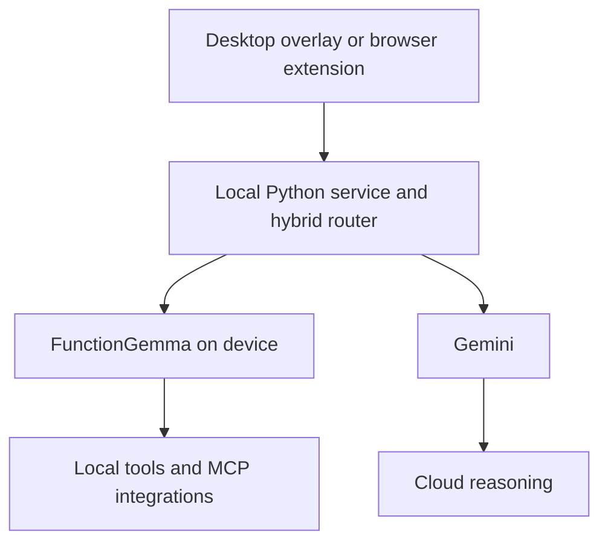

  

# Nova

**Cactus x Google DeepMind Hackathon project for hybrid on device and cloud AI assistance.**

Nova routes suitable requests to a fast, private on device FunctionGemma model and uses Gemini for broader reasoning.

## What We Built

- A hybrid routing strategy balancing correctness, latency, and local model usage
- An Electron desktop overlay for voice, screen, and tool assisted workflows
- A browser activity monitor with local categorization and cloud fallback
- Tool integrations for desktop actions and external services

## Demo Walkthrough

1. Start the local Cactus runtime and Nova backend.
2. Open either the desktop overlay or browser extension.
3. Submit a voice, text, screen, or browsing context request.
4. Route suitable tool calls through the local FunctionGemma model.
5. Use Gemini when the local result is uncertain or the task requires broader reasoning.

## Architecture

## Public Repositories

| Repository | Purpose |
| --- | --- |
| [base](https://github.com/switchchat/base) | Original hybrid routing challenge, benchmark, and submission workflow |
| [desktop](https://github.com/switchchat/desktop) | Electron desktop assistant and hybrid AI backend |
| [extension](https://github.com/switchchat/extension) | Chrome activity monitor and local analysis service |

## Note

Nova can route requests to Gemini and external tools. Review the configured services before using sensitive data.

[Explore the Nova repositories](https://github.com/orgs/switchchat/repositories)
